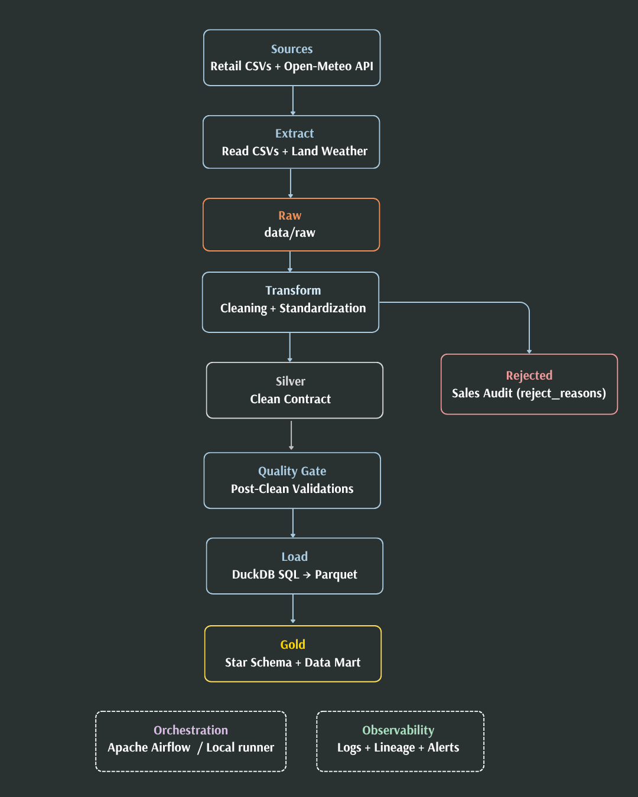

# Retail Weather ETL

`retail-weather-etl` is a local-first ETL project that combines retail sales and daily weather data to produce a clean analytical model in DuckDB and publish business-ready gold outputs in Parquet. The pipeline covers the full flow from raw ingestion and profiling to cleaning, quality validation, SQL modeling, lineage, and optional Airflow orchestration.

<p align="center">
  
</p>

The project is designed to be easy to run and easy to inspect. The README stays executive on purpose: key commands live here, architecture and operational decisions live in `docs/`, and dataset-level guarantees live in the data contract. Module-level implementation detail belongs in the code docstrings.

## Core Stack

### Runtime & data

- `Python 3.11`
- `pandas` and `numpy`
- `DuckDB` and `PyArrow`
- `Pydantic`, `Pandera`, and `PyYAML`
- `requests`
- optional `Airflow` + `Docker` runtime

### Quality & CI

- `pytest` (unit + integration)
- `ruff`, `black`, and `mypy`
- `bandit` and `pip-audit`
- `uv` for dependency management
- GitHub Actions on push/PR (Python 3.11 + 3.12)

## Key Commands

### Setup

Base environment:

```bash
uv sync --locked
```

Make shortcut:

```bash
make setup-dev
```

Full environment, including security tools:

```bash
uv sync --locked --all-groups
```

### Run

```bash
uv run python -m pipelines.pipeline
```

Optional offline run using the existing `data/raw/weather_daily.csv`:

```bash
uv run python -c "from pipelines.pipeline import run_pipeline; run_pipeline(fetch_weather=False)"
```

### Test

```bash
uv run python -m pytest -q
uv run python -m pytest -q tests/unit
uv run python -m pytest -q -m integration
```

Make shortcuts:

```bash
make test
make test-unit
make test-integration
```

### Code Quality and Security

```bash
uv run ruff check .
uv run black --check .
uv run mypy
uv run bandit -r etl pipelines dags
uv run pip-audit
```

These checks complement the test suite:

- `ruff`, `black`, and `mypy` cover code quality and type safety
- `bandit` and `pip-audit` cover static security checks and dependency auditing

### Airflow

`make env-init` copies `.env.example` and sets `AIRFLOW_UID` to your `id -u`.
`make airflow-start` also creates `logs/airflow` so Docker does not create that bind mount as root.
If `.env` already exists, add `POSTGRES_USER`, `POSTGRES_PASSWORD`, and `POSTGRES_DB` from `.env.example` before starting Compose.

```bash
make env-init
make airflow-start
```

Stop everything with `make airflow-down`.

Airflow defaults to offline weather mode and reuses the existing `data/raw/weather_daily.csv`.
Set `RETAIL_ETL_FETCH_WEATHER=true` in `.env` only when you want the DAG to refresh weather from the API during `extract`.

UI (in a Codespace, forward port `8080`; Compose binds `127.0.0.1:8080` on the host):

- URL: `http://127.0.0.1:8080`
- Username: `admin`
- Password: `change_me` (from `.env.example`; change it in `.env` before the first `airflow-init`)

The DAG starts paused. Unpause and trigger it from the UI, or:

```bash
cd docker
docker compose --env-file ../.env exec airflow-scheduler airflow dags unpause retail_weather_etl
docker compose --env-file ../.env exec airflow-scheduler airflow dags trigger retail_weather_etl
```

A green run writes `data/processed/silver/`, `data/processed/gold/parquet/`, and `logs/etl/lineage/`.

If a previous failed start left `logs/` owned by root:

```bash
sudo chown -R "$(id -u):$(id -g)" logs
make airflow-start
```

## Published Layers

- `data/raw`: retail CSV inputs plus landed `weather_daily.csv`
- `data/processed/silver`: cleaned public pre-SQL datasets
- `data/processed/rejected`: rejected sales rows with `reject_reasons`
- `data/processed/gold`: exported star schema tables and analytical mart

Core gold datasets:

- `dim_customers`
- `dim_products`
- `dim_weather`
- `fact_sales`
- `weather_sales_mart`

## Documentation

- Architecture: [docs/ARCHITECTURE.md](docs/ARCHITECTURE.md)
- Technical decisions: [docs/DECISIONS.md](docs/DECISIONS.md)
- Runbook: [docs/RUNBOOK.md](docs/RUNBOOK.md)
- Data contract: [docs/DATA_CONTRACT.md](docs/DATA_CONTRACT.md)
- Testing guide: [docs/TESTING.md](docs/TESTING.md)

## Diagrams

- [Architecture diagram](docs/images/architecture.png)
- [Data layers diagram](docs/images/data_layers.png)
- [Local execution flow](docs/images/local_execution_flow.png)
- [Airflow orchestrated flow](docs/images/airflow_orchestrated_flow.png)
